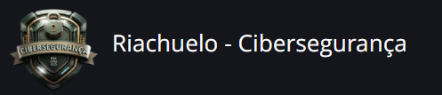

Riachuelo - Cibersegurança
# Detalhes do bootcamp
Prepare-se para construir uma base sólida em Linux e máquinas virtuais, entender os fundamentos de redes e segurança, e evoluir para hacking ético, identificando vulnerabilidades e aplicando boas práticas de proteção — tudo com uma trilha atualizada que inclui IA e engenharia de prompts para acelerar sua aprendizagem.

É um conteúdo completo e alinhado ao dia a dia de quem quer atuar com segurança ofensiva e defensiva, com aulas, desafios e projetos que simulam cenários reais (de varredura de rede a análises e mitigação de ataques).

Atividades:
Cursos: Aulas em vídeo curtas e objetivas que apresentam um conteúdo por vez, facilitando o aprendizado no seu ritmo. Cada curso traz explicações práticas e uma avaliação ao final para confirmar o que você aprendeu.

Mentorias (Live): As mentorias oferecem encontros ao vivo com especialistas, onde você pode aprofundar o entendimento dos temas do bootcamp, tirar dúvidas e discutir aplicações práticas. São momentos para trocar experiências, receber orientação direta e acelerar sua evolução com quem já atua no mercado.

Desafio de Código: Desafios práticos de programação para você aplicar o que aprendeu nos cursos, resolvendo problemas reais e desenvolvendo seu raciocínio lógico e suas habilidades técnicas.

Desafio de Projeto: Projetos completos em que você reúne tudo o que aprendeu em diferentes conteúdos para resolver um problema real, criando uma entrega final que pode fazer parte do seu portfólio.

Ferramentas para o seu aprendizado:
Meta de estudo: Permite planejar sua rotina de estudos, definindo quantos dias por semana você quer avançar no bootcamp. A partir disso, a plataforma calcula o tempo estimado para concluir todas as atividades e obter o certificado.

Ranking: O Ranking avalia sua performance no bootcamp somando pontos de Submissões de Qualidade (SQ), como desafios e questionários, e Interações de Qualidade (IQ) no fórum. Ele reflete sua participação real na jornada, valorizando qualidade acima de velocidade.

Fórum: O Fórum é o espaço para tirar dúvidas, trocar experiências e aprender com outras pessoas. É onde você pode pedir ajuda, responder perguntas e construir conhecimento de forma colaborativa ao longo da jornada.

Rooms: Espaços de interação em tempo real onde os alunos podem trocar conhecimento, colaborar em atividades do bootcamp e conversar com outros participantes da comunidade.

Pessoas: Veja quem está trilhando a mesma jornada que você, acompanhe outros participantes e fortaleça sua rede seguindo colegas do bootcamp.

Certificado: Ao concluir todas as atividades do bootcamp, você recebe um certificado oficial de conclusão. Além disso, a cada nova habilidade desenvolvida nos cursos, você também conquista certificados específicos que comprovam sua evolução ao longo da jornada.